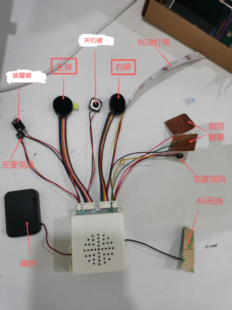

# 欢迎使用 MarkdownPro

## 功能特点

- **按钮**:
	右 开机键 长按3秒开机
	左 唤醒键 设备开机并成功启动后 单机切换设备状态 4G/wifi切换
- **屏幕**:
   同显
- **RGB灯带**:
有5个语音控制指令
①　自动灯光状态控制（默认开启）：
 关机---灯熄灭；开机过程---灯发黄光；待机状态---蓝光；说话状态---绿光；聆听状态---红光
控制：“开启/关闭灯光自动控制”
**注意：在关闭自动灯光状态控制后才能进行以下灯光控制**
②　 “开/关灯”：开灯：灯亮白色；关灯：灯熄灭
③　 “进行呼吸灯效果”
④　 “彩虹效果”
⑤　 “追逐效果”
⑥　 “闪烁效果”
⑦　 “设置灯光亮度为30”---亮度1-100
- **4G/WIFI模式切换**:
在设备开机时，双击唤醒键键切换模式：4G—>WIFI或WIFI—>4G；
- **WIFI配网**:
在wifi模式下双击唤醒键键重新配网
- **铜箔触摸**:
使用铜箔触摸，可以通过语音控制（默认开启）--“开启/取消触摸”
**开心的回应**{"主人你好呀。", "好开心呀，主人摸我了。", "好舒服呀，再摸摸我。",
  "主人，我好喜欢你！", "嘿嘿，好幸福呀~", "最喜欢主人了！"};
**生气的回应** {"哎呀，主人你摸疼我了！", "呜呜，再这样摸我要生气啦！", "轻点嘛，人家会疼的！", "不要戳我脑袋啦，会坏掉的！"};
**思考的回应** {"怎么了主人，有什么事吗？", "嗯...让我想想这是什么感觉","主人这是什么意思呢？", "我在思考这个触摸的含义..."{ "哎呀，主人你怎么一直摸我？这样我会不高兴的！","主人，你摸太多次了，我有点不舒服了，再这样我要生气了！" };
- **唤醒小智**:
语音唤醒  - 说 "你好小智"唤醒小智
按钮唤醒  - 单击唤醒键键唤醒小智
头部触摸唤醒  - 触摸头顶，会发送摸头事件唤醒小智
摇晃唤醒  - 摇晃主机唤醒小智
- **电量显示**:
通过语音“你现在有多少电量？”获取当前电量
**注意：电量低于10%且未充电，设备自动关机**

## 视图


## 快速开始

开始编写您的Markdown文档吧！

```javascript
console.log("Hello MarkdownPro!");
```

> 这是一个引用示例

### 列表示例

1. 有序列表项1
2. 有序列表项2
3. 有序列表项3

- 无序列表项A
- 无序列表项B
- 无序列表项C

### 表格示例

| 功能 | 状态 | 说明 |
|------|------|------|
| 实时预览 | ✅ | 已完成 |
| 语法高亮 | ✅ | 已完成 |
| 导出功能 | ✅ | 已完成 |

**祝您使用愉快！**